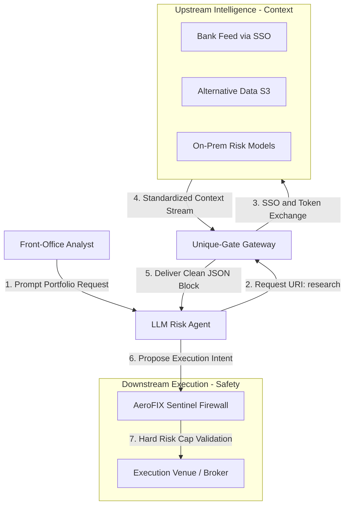

# MCP Finance Gateway (`Unique-Gate`)

An institutional-grade implementation of the **Model Context Protocol (MCP)** designed for multi-broker session isolation, secure authentication mapping via OIDC layout, and real-time portfolio resource streaming.
This gateway bridges the gap between agentic LLM context windows and secure capital markets data endpoints, bypassing traditional end-of-day batch processing lag and manual single sign-on (SSO) barriers.
---
## 🏗️ Architecture Overview
The gateway operates across two primary vector spaces to handle sensitive institutional workflows:
* **Upstream Intelligence (Context Aggregation & Narrative Compilation):** Normalizes fragmented research endpoints—whether behind an external vendor's SSO or an internal secure cloud database—into standardized, read-only URI schemes (`research://`). Includes an active processing layer that distills raw data feeds into polished, front-office narrative briefs.
* **Downstream Operations (Session Isolation & Safety Firewall):** Dynamically instantiates isolated runtime environments for unique brokerage integrations mapped via secure token parameters to prevent horizontal data leaks, while routing all agent execution intents through deterministic risk firewalls.
### System Workflow Blueprint

